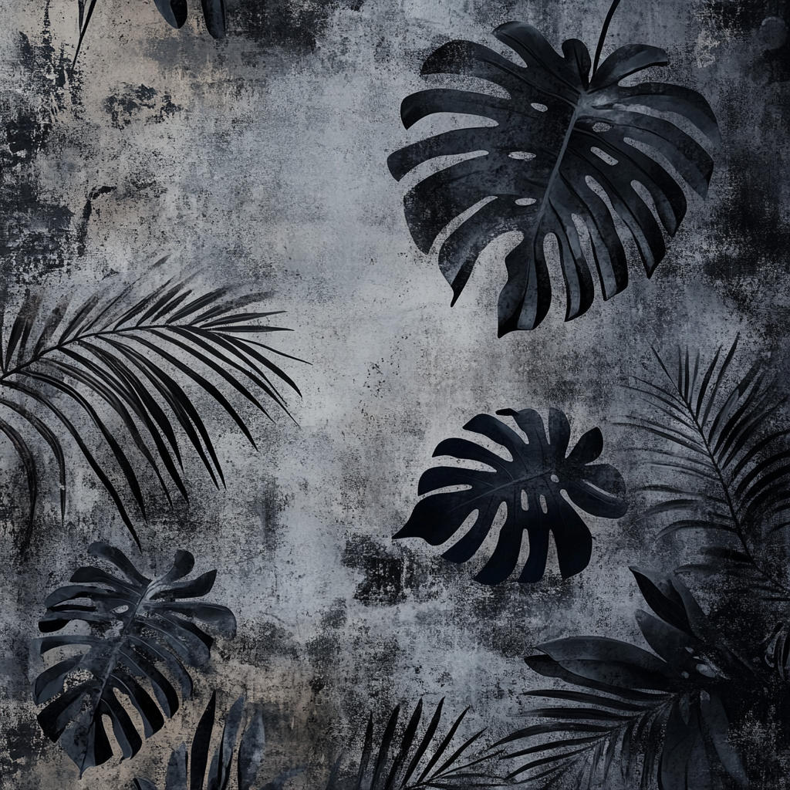

# SPOOL

A handheld-feel sampler / looper / field recorder inspired by the Teenage Engineering TP-7. Ships as a Windows VST3 plugin and a standalone app.



> 💛 **Free & open source.** If SPOOL earns a place in your workflow, a one-off [Ko-fi tip](https://ko-fi.com/itselliott) or [GitHub Sponsorship](https://github.com/sponsors/itselliott) keeps the lights on. Zero pressure — the plugin stays free either way.

---

## What it does

- **Drag-and-drop sampler** — drop a WAV / AIF / FLAC / MP3 / OGG onto the panel, or load via the ↑ button.
- **Live field recorder** — REC captures from the default audio input; auto-loops on stop (RC-505 style).
- **Loop region** — drag across the waveform to set a custom loop; or pick a tempo-relative size (1/16 · 1/8 · 1/4 · 1/2 · 1B · 2B) that follows BPM.
- **Eight loop slots** — left-click to save, right-click to clear, or press `1`-`8` (number row or keypad) to recall.
- **Tempo-synced effects** — GHOST delay, FILTER LFO, ARP rate, and the loop-size grid all follow the internal BPM you set.
- **Three big "JUICE" effect knobs** — drag the icons to reorder the signal chain.
- **MIDI sampler** — play the loaded sample chromatically. 8-voice polyphony, C4 = root, works with any MIDI controller AND the on-screen keyboard.
- **On-screen keyboard** — toggle the **♪ KEYS** pill to reveal a 2-octave keyboard with pitch wheel + mod wheel + ARP. Or just type `a w s e d f t g y h u j k …` to play notes; `z` / `x` shift octaves.
- **Arpeggiator** — engage **ARP** on the keyboard; held notes cycle in UP / DN / UPDN / RND patterns at a tempo-synced rate (mod wheel selects 1/4 → 1/32).
- **LO-FI master mode** — one-button "cassette" character: warm tanh saturation + bit-crush + HF rolloff, dialled with a dry/wet knob under the button. The whole chassis re-skins pink-purple with animated film grain when engaged.
- **DJ scratching** — grab the spinning vinyl and drag to scrub with a soft cartridge LP for authentic feel.
- **Theme randomizer** — double-click the SP-L wordmark for a fresh accent color.

---

## Controls

### Transport
| Control | Action |
|---|---|
| ● **REC** | Capture from input. Click again to stop — auto-plays in loop mode. |
| ▶ **PLAY** | Toggle playback. Also bound to **spacebar**. |
| ■ **STOP** | Stop playback. |

### Tempo
| Control | Action |
|---|---|
| **BPM window** | Drag vertically — up = faster, shift+drag = fine. |
| **TAP** | Tap 2-4 times in rhythm to lock tempo. Session resets after 2s silence. |

### Loop
| Control | Action |
|---|---|
| **Drag waveform** | Highlight a custom loop region. |
| **1/16 · 1/8 · 1/4 · 1/2 · 1B · 2B** | Lock loop length in beats at current BPM. Recomputes if BPM changes. |
| **−12 · −24 · BKWL** | Loop wrap fade slope — soft, harder, brick-wall. |
| **NUDGE slider** | Translate the loop region left/right. Release to commit. |
| **Double-click waveform** | Set LOOP anchor at clicked position. |
| **Ctrl+scroll waveform** | Zoom in / out on the sample. |

### INPUT preamp
| Control | Action |
|---|---|
| **INPUT knob** | Dry/wet preamp blend. LED meters input level. |
| **Comp LED** (under INPUT) | Cycle voice: amber = VINTAGE, red = FET, cyan = OPTO. |

### SPEED
| Control | Action |
|---|---|
| **SPEED knob** | Varispeed 0.5×..2×. Slowing adds tape-style bit-crush + sample-rate reduction. |
| **TAPE knob** | Wet/dry tape saturation. |
| **Tape LED** (under TAPE) | Cycle machine: orange = SAT, green = WOW (modulation), magenta = LO-FI (bit-crush). |

### JUICE effect knobs (drag the top icon to reorder the chain)

| Knob | Companion buttons |
|---|---|
| **FILTER** (LP/HP DJ sweep) | `Q` (LO/MD/HI) · `RATE` (OFF/1/2..1/128 LFO) · `RANGE` (SM/MD/LG) |
| **GHOST** (filtered feedback delay) | `1/16` / `1/8` / `1/4` delay time |
| **HAZE** (reverb) | snowflake **FREEZE** · preset cycle (VAULT/CHROME/NEST/MIST/ABYSS/AURA) |

### Slots
| Control | Action |
|---|---|
| **Click slot 1–8** | Save current loop region (with all effect state) or load if filled. |
| **Right-click slot** | Clear. |
| **Number keys 1–8** | Load only (won't accidentally overwrite). |

### MIDI sampler
| Control | Action |
|---|---|
| **MIDI Note-On** | Plays the loaded sample at a pitch-shifted rate (C4 = note 60 = root). |
| **Polyphony** | 8 voices, oldest-voice steal. |
| **Co-exists with PLAY** | Perform live MIDI on top of a running PLAY-button loop. |

### On-screen keyboard
Toggle the **♪ KEYS** pill above the transport row to show / hide the bottom keyboard strip.

| Control | Action |
|---|---|
| **Click the keys** | Play notes via mouse. |
| **PITCH wheel** (left of keyboard) | ±12 semitones. Snaps back to centre on release. |
| **MOD wheel** (right of keyboard) | When ARP off → tremolo depth (5 Hz). When ARP on → arp rate selector (1/4 · 1/8 · 1/16 · 1/32 in four zones). |
| **`a w s e d f t g y h u j k o l`** | Computer-keyboard note input. `a` = base C (default C4). |
| **`z`** | Octave down. |
| **`x`** | Octave up. |

### Arpeggiator
On the keyboard strip:

| Control | Action |
|---|---|
| **ARP** pill | Toggle arp engine. Held notes cycle at BPM-synced rate. |
| **PATTERN** pill | Cycle UP / DN / UPDN / RND. |
| **MOD wheel** | Selects rate while ARP is on. |

### LO-FI master mode
| Control | Action |
|---|---|
| **LO-FI** pill (under SP-L) | Engage warm tanh saturation + 5-bit crush + 7 kHz HF rolloff on the final mix. Chassis re-skins pink/purple with animated film grain. |
| **LO-FI knob** (under the pill) | Dry/wet. Default 80% → 40% wet. Max 100% → 50% wet. Double-click → 80%. |

### Folder browse (corner of OLED)
- `◫` pick a folder; `−` / `+` step through audio files in it.

### Easter eggs
- **Double-click SP-L logo** → randomize the accent color theme. State preserved across slots.

---

## Build

Requires **CMake 3.22+** and a C++17 toolchain (Visual Studio 2022 on Windows, Xcode on macOS, GCC/Clang on Linux). JUCE 8.0.4 is pulled in via `FetchContent`.

```bash
cmake -S . -B build
cmake --build build --config Release
```

Build artefacts land under `build/SPOOL_artefacts/Release/`:
- `Standalone/SPOOL.exe` — runs as a desktop app
- `VST3/SPOOL.vst3/` — drop into your DAW's VST3 folder
- (on macOS) `AU/SPOOL.component`

### Just the standalone or just the VST3

```bash
cmake --build build --config Release --target SPOOL_Standalone
cmake --build build --config Release --target SPOOL_VST3
```

---

## Theming (optional)

SPOOL paints over the silver chassis with an optional background image. To add one, drop a `bg.jpg`, `bg.png`, `background.jpg`, or `background.png` into any of these:

1. `<cwd>/assets/` — the working directory's assets folder (default in repo)
2. `%APPDATA%/SPOOL/assets/` on Windows / `~/Library/Application Support/SPOOL/assets/` on macOS / `~/.config/SPOOL/assets/` on Linux
3. `<plugin install dir>/assets/`

First match wins. No image = blank silver panel.

---

## Logs

Diagnostic logs land in:

- Windows: `%APPDATA%\SPOOL\spool.log`
- macOS: `~/Library/Application Support/SPOOL/spool.log`
- Linux: `~/.config/SPOOL/spool.log`

Cleared each launch. Useful when reporting crashes.

---

## Support / bug reports

Found a bug or want to suggest a feature?

- **Email**: [elliottdevs@gmail.com](mailto:elliottdevs@gmail.com?subject=SPOOL%20Bug%20Report) — pre-filled subject so it lands in the right pile. Please include your SPOOL version (shown in the standalone Options → menu, or hover the version line in About / Credits), OS, DAW (if applicable), what happened, and steps to reproduce.
- **GitHub Issues**: [github.com/itselliott/spool/issues](https://github.com/itselliott/spool/issues) — great for anything reproducible.
- **In-plugin shortcut**: standalone → Options menu → **Report a Bug** → opens your default mail client with the version + OS template already filled out.

## Support development

SPOOL is free forever. If it earned a spot in your toolbox, optional tips keep the lights on:

- [Tip on Ko-fi](https://ko-fi.com/itselliott) — one-off or recurring, 0% fee on direct tips.
- [GitHub Sponsors](https://github.com/sponsors/itselliott) — monthly or one-off, GitHub takes 0%.

---

## License

SPOOL is built on [JUCE 8](https://juce.com/), pulled in via CMake `FetchContent` under JUCE's GPLv3 terms. The SPOOL source code itself is provided as-is; redistribution must comply with JUCE's licensing — see [juce.com/get-juce/](https://juce.com/get-juce/) for commercial licensing if you intend to ship binaries non-GPL.
